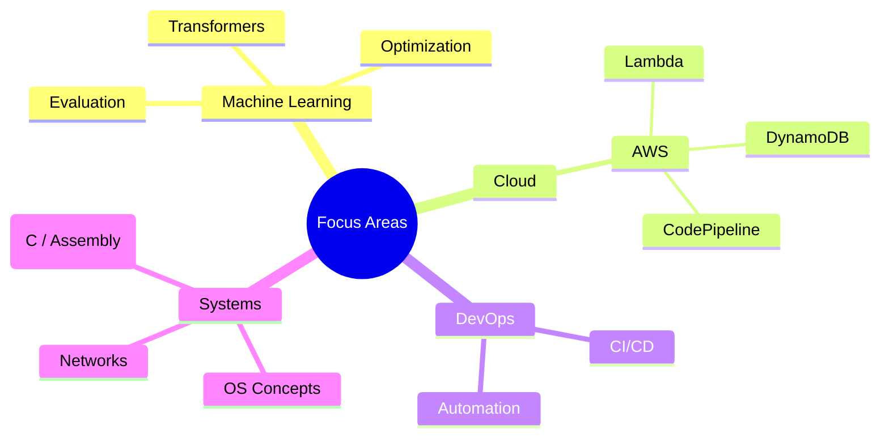

#  Hi, I'm Harmanpreet Sidhu

  <!-- Header / banner GIF (replace with your own; keep it ~<2MB for faster load) -->
  

## Skills

**Programming:** Java · Python · C · Assembly  
**Web Development:** Django · HTML · CSS  
**Databases:** MySQL · AWS DynamoDB  
**Cloud & DevOps:** AWS Lambda · S3 · DynamoDB · EventBridge · CloudFront · CodePipeline · CodeBuild · IAM  
**Tools:** Git · GitHub · Microsoft Office Suite · Clipchamp  
**Engineering Fundamentals:** System setups · Sensor integration · Project coordination  
**Languages:** English · Punjabi · Hindi  
**Soft Skills:** Communication · Leadership · Teamwork · Problem-solving  

## Certifications

- AWS Certified Cloud Practitioner (CLF-C02), 2025  
https://www.credly.com/badges/acc1965f-0d35-4a25-a730-4d8b709428f5/public_url

## Featured Projects

| Project | Summary | Tech Stack |
|---------|---------|------------|
| Transformer from Scratch (English → Spanish) | Implemented the original "Attention Is All You Need" architecture in PyTorch for machine translation; custom encoder-decoder, multi-head attention, positional encoding, training loop, checkpointing, BLEU-style evaluation. | PyTorch · Python · NLP |
| Serverless Job Tracking App | Event-driven job tracker using AWS Lambda + EventBridge for scheduled runs; CRUD workflows backed by DynamoDB with scalable schema design. | AWS Lambda · DynamoDB · EventBridge · Python |
| AWS Portfolio Deployment Pipeline | CI/CD pipeline deploying personal site via CodePipeline + CodeBuild to S3 with CloudFront distribution; automated GitHub integration and IAM role policies. | AWS S3 · CloudFront · CodePipeline · CodeBuild |

<!-- Add links when ready:
[Transformer Repo](https://github.com/USERNAME/REPO) · [Hugging Face Model](https://huggingface.co/USERNAME/MODEL)
[Serverless App](https://github.com/USERNAME/REPO)
[Portfolio Site](https://harmanpreetsidhu.com)
-->

## Tech Focus Diagram 

## 📫 Connect

- Website: [harmanpreetsidhu.com](https://harmanpreetsidhu.com)  
- Email: [hssidhu@csus.edu](mailto:hssidhu@csus.edu)  
- GitHub: [harmansingh2005](https://github.com/harmansingh2005)  
- LinkedIn: [Your LinkedIn Name]([https://www.linkedin.com/in/USERNAME/](https://www.linkedin.com/in/harmanpreet-sidhu-077195323/))
- Hugging Face: [Your HF Handle](https://huggingface.co/USERNAME)
